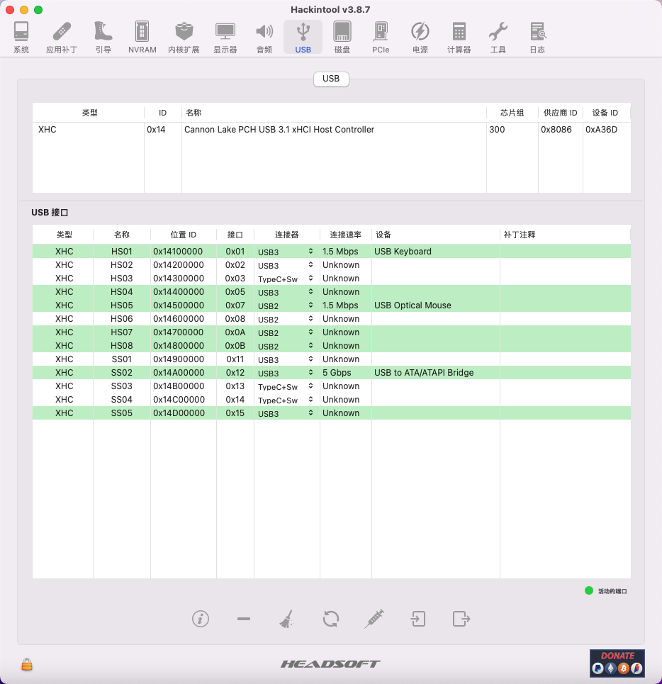

# ASUS-Prime-B360M-A-8700-RX560-0.8.3-12.4
# ASUS-Prime-B360M-A-8700-P2000-5109-10.13.6

#### 介绍

- 更新OC版本为0.8.3开发版，支持Mojave & Catalina & Big Sur & Monterey & Ventura
- 更新Clover版本为5109，支持High Sierra
- 目前安装版本为12.4，机型为iMac18，3

#### 配置

- 主板：ASUS Prime B360M-A
- CPU：i7-8700
- 显卡：RX560/UHD630、P2000/UHD630
- 显示器：4K
- 硬盘：西数SN850+PM9A1
- 板载网卡：RTL8168
- 无线网卡：无

#### 工作

- 主板HDMI音频输出
- 板载声卡输出
- 所有USB接口
- 开启HIDPI
- 独显/核显加速
